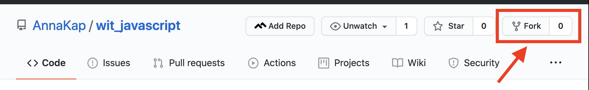

# the \<wit\> project workshop: "Javascript"

## 🖥 Get this workshop on your local machine

1. Frok this repo from github

2. Clone your forked repo: 
    1. **remember** to cd in to your desired directory first
    2. then: `git clone <this repo's remote url>`
3. Change directories: `cd wit_project`
4. In terminal run `open -a "Google Chrome" index.html` to open your index.html in the browser
 
 

## 🖥  Dev Tools 
1. using google chrome, right click on the window where your index.html is opened
2. select inspect
3. select the console window and look for your next instructions
4. ping the zoom chat if you are having trouble finding these next instructions
 
 

## 🖥  Level 2: Const and Let
1. After you have completed the instructions from your web console close the browser
2. In terminal run `open -a "Google Chrome" level2.html` to open your second html file in the browser
3. All further intstructions you will get from within each level.

